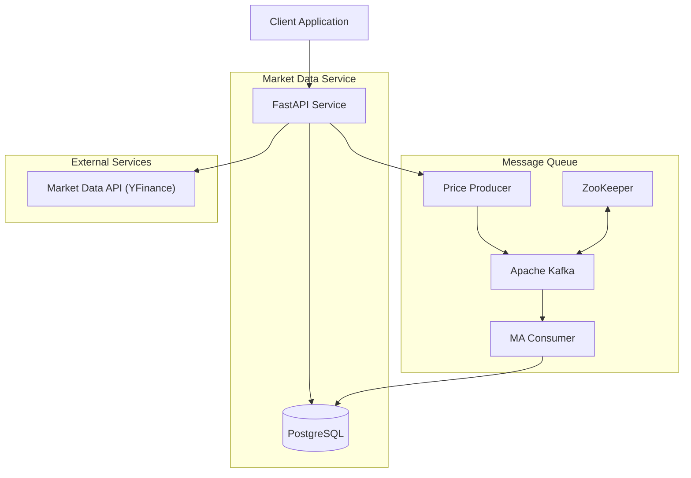
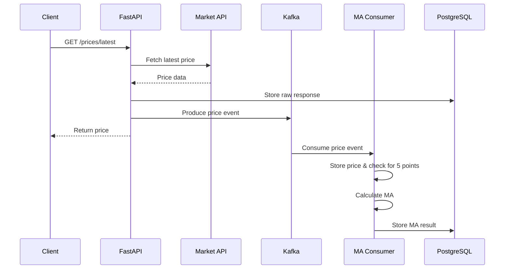

# 📈 Market Data Service

A production-ready microservice that fetches real-time market data, streams it through Kafka, computes 5-point moving averages, stores it in PostgreSQL, and serves it via RESTful APIs using FastAPI.

---

## 🚀 Features

- Fetch latest prices using **yfinance**
- Poll and stream price events to Kafka
- Compute and persist 5-point **moving averages**
- REST API endpoints for real-time & historical data
- PostgreSQL integration with SQLAlchemy ORM
- Kafka integration with `confluent-kafka-python`
- Dockerized setup and GitHub Actions CI pipeline

---

## 📦 Project Structure

```
market-data-service/
├── app/
│   ├── api/          # FastAPI routes
│   ├── core/         # Database models & config
│   ├── models/       # (Reserved for domain models)
│   ├── services/     # Kafka producer logic
│   └── schemas/      # Pydantic schemas
├── tests/            # Pytest test cases
├── docs/             # Documentation & diagrams
├── docker/           # Dockerfile and related configs
├── .github/workflows # GitHub Actions CI
├── requirements/     # Requirements files
├── scripts/          # Scripts for table creation, etc.
└── README.md
```

---

## ⚙️ Setup Instructions

### 1. Clone the Repository

```bash
git clone https://github.com/yourusername/market-data-service.git
cd market-data-service
```

### 2. Install Dependencies

```bash
pip install -r requirements/requirements.txt
```

### 3. Start Services with Docker

```bash
docker compose up
```

> Note: This starts PostgreSQL, Kafka, and Zookeeper

### 4. Run the API Server

```bash
uvicorn app.api.main:app --reload
```

### 5. Run the Kafka Consumer

In a separate terminal:

```bash
python kafka_consumer.py
```

### 6. Create Tables (if needed)

```bash
python scripts/create_tables.py
```

### 7. Run Tests

```bash
pytest
```

---

## 🧪 API Endpoints

### 🔹 GET `/prices/latest?symbol=AAPL`

**Response:**
```json
{
  "symbol": "AAPL",
  "price": 150.25,
  "timestamp": "2024-03-20T10:30:00Z",
  "provider": "yfinance"
}
```

---

### 🔹 POST `/prices/poll`

**Request:**
```json
{
  "symbols": ["AAPL", "MSFT"],
  "interval": 60,
  "provider": "yfinance"
}
```

**Response:**
```json
{
  "job_id": "poll_123abc",
  "status": "accepted",
  "config": {
    "symbols": ["AAPL", "MSFT"],
    "interval": 60,
    "provider": "yfinance"
  }
}
```

---

### 🔹 GET `/moving-average?symbol=AAPL`

**Response:**
```json
{
  "symbol": "AAPL",
  "moving_average": 150.12,
  "timestamp": "2024-03-20T10:30:00Z"
}
```

---

### 🔹 GET `/prices/history?symbol=AAPL`

**Response:**
```json
[
  {
    "symbol": "AAPL",
    "price": 149.8,
    "timestamp": "2024-03-20T10:25:00Z",
    "source": "yfinance"
  },
]
```

---

## 🏗️ System Architecture



---

## 🔁 Data Flow Diagram



---

## 🛠 GitHub Actions CI

- ✅ Lint with `flake8`
- ✅ Run all `pytest` test cases
- ✅ Set up PostgreSQL in CI
- ✅ Automatically creates DB tables

---
